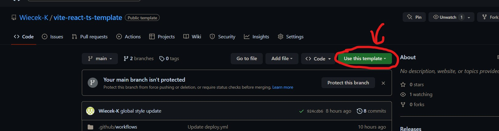
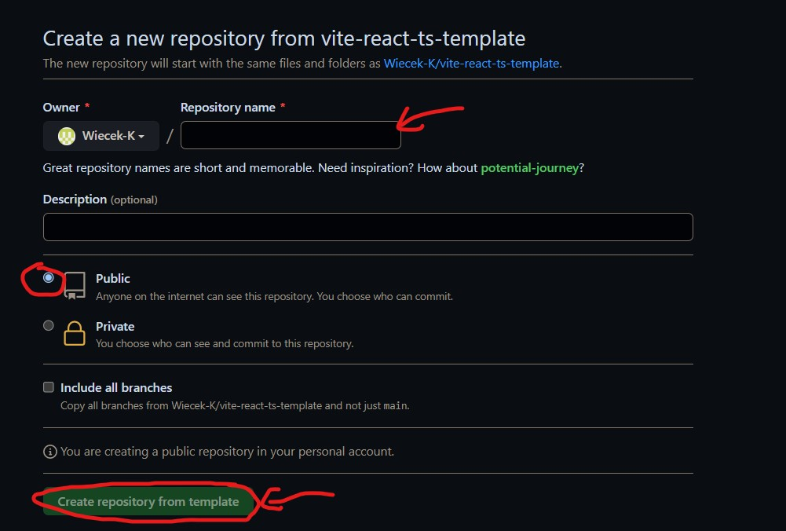
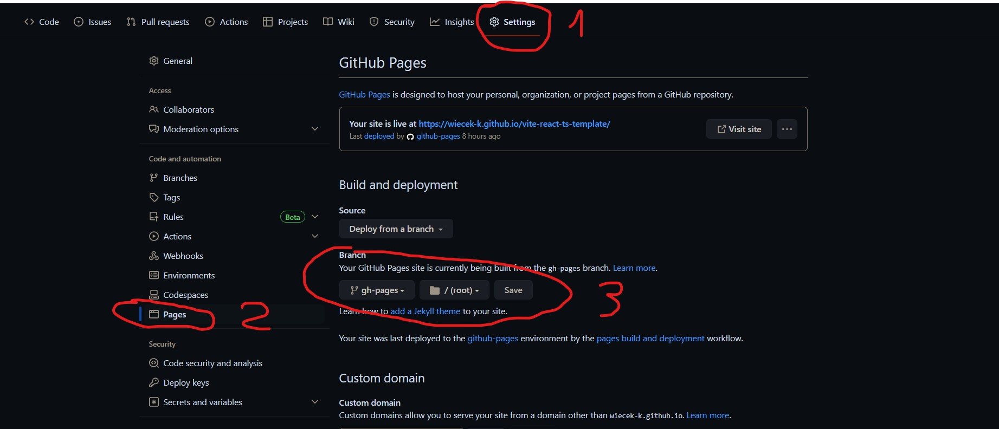
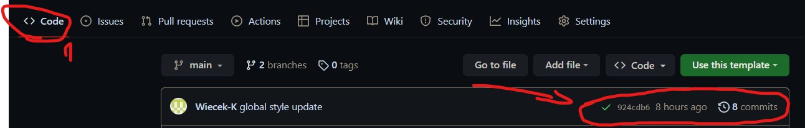

# Vite React-TypeScript Template

This project was created with
[Vite-create](https://github.com/vitejs/vite/tree/main/packages/create-vite). To get
acquainted and configure additional features
[refer to documentation](https://vitejs.dev/guide/).

## Creating a repository by template

Use this repository as a template for creating a repository
of your project. To use it just tap the `«Use this template»` button and choose
`«Create a new repository»` option, as you can see on the image below.



The page for creating a new repository will open on the next step. Fill out
the Name field and make sure the repository is public, then click
`«Create repository from template»` button.



You now have a personal project repository, having a repository-template file 
and folder structure. After that, you can work with it as you would with any 
other private repository: clone it on your computer, write code, commit, and 
send it to GitHub.

## Preparing for coding

1. Make sure you have an LTS version of Node.js installed on your computer.
   [Download and install](https://nodejs.org/en/) if needed.
2. Install the project's base dependencies with the `npm install` command.
3. Start development mode by running the `npm start` command.
4. Go to [http://localhost:5173/vite-react-ts-template/](http://localhost:5173/vite-react-ts-template/) in your browser. This
   page will automatically reload after saving changes to the project files.

## Deploy

The production version of the project will automatically be linted, built, and
deployed to GitHub Pages, in the `gh-pages` branch, every time the `main` branch
is updated. For example, after a direct push or an accepted pull request. To do
this, you need to edit the `base` field in the `vite.config.ts` file,
replacing `"/vite-react-ts-template/"` with your own repo name, and submit the
changes to GitHub.

```json
"base": "/your-repo-name/",
```

Next, you need to go to the settings of the GitHub repository (`Settings` >
`Pages`) and set the distribution of the production version of files from the
`/root` folder of the `gh-pages` branch, if this was not done automatically.



### Deployment status

The deployment status of the latest commit is displayed with an icon next to its
ID.

- **Yellow color** - the project is being built and deployed.
- **Green color** - deployment completed successfully.
- **Red color** - an error occurred during linting, build or deployment.

More detailed information about the status can be viewed by clicking on the
icon, and in the drop-down window, follow the link `Details`.



### Live page

After some time, usually a couple of minutes, the live page can be viewed at the
address `https://<your-gh-name>.github.io/<your-repo-name>/` property. For example, here is a link
to a live version for this repository
[https://wiecek-k.github.io/vite-react-ts-template/](https://wiecek-k.github.io/vite-react-ts-template/).

If a blank page opens, make sure there are no errors in the `Console` tab
related to incorrect paths to the CSS and JS files of the project (**404**). You
most likely have the wrong value for the `base` property in the
`vite.config.ts` file.

